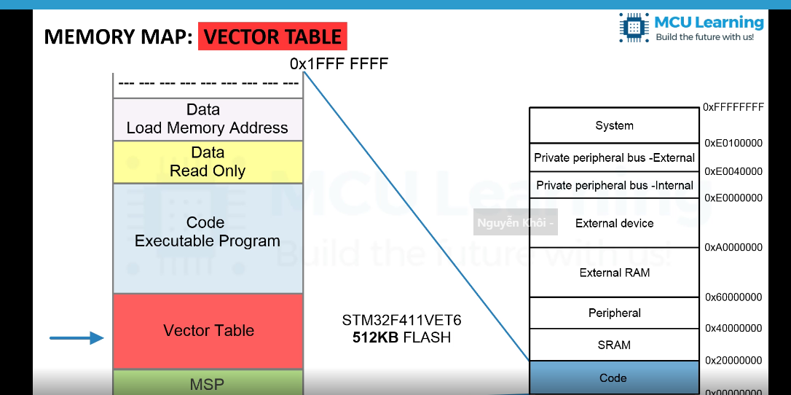
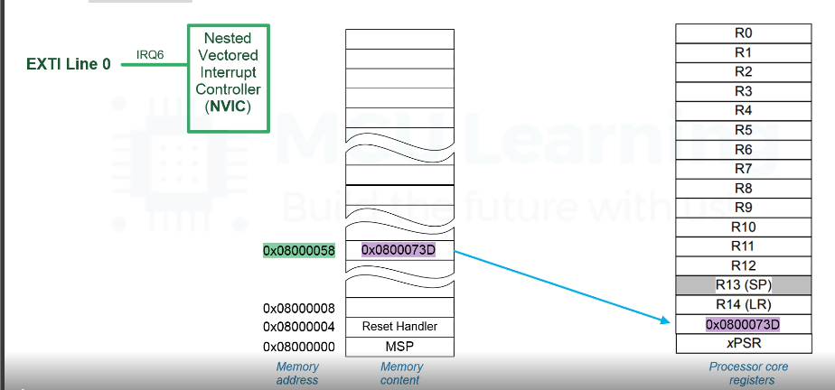

### Chương trình trong bộ nhớ

-MSP(main stack pointer) : Trong các vi điều khiển ARM Cortex-M, MSP là một thanh ghi đặc biệt dùng để quản lý ngăn xếp chính của chương trình. 0x00000000 giá trị này cũng là giá trị bắt đầu của vùng nhớ stack trong sRam.

-Vector table: danh sách bắt đầu của các chương tì phục vụ exception. resethandler (0x0000 0004)

-code : mã máy của các hàm các lệnh trình biên dịch tạo thành 

-data read only: các dữ liệu hằng không thay đổi giá trị tronmg suốt quá trình hoạt động

-Data LMA : chứa các giá trị của các biến khởi tạo khác không

* Quá trình khởi động của vxl: 
Sau khi reset VXL khởi tạo giá trị SP bằng cách đọc giá trị tại địa chỉ 0X00000000 và nạp giá trị cho thanh ghi MSP vf khi khởi động thanh ghi Stack pointer sẽ dùng giá trị của thanh ghi MSP  giá trị này cũng là giá trị bắt đầu trong vùng nhớ SRAM. qua bước này thì VDK đã biết được nên bắt đầu ở đâu. 

tiếp theo VDK sẽ đọc giá trị của địa chỉ 0x0000004 nạp cho thanh ghi PC(chính là resethandler)

nảy đến hàm main và thực hiện chương trình ứng dụng trong hàm main.

VXL không chỉ reset bằng nút mà còn có thể reset mềm bằng hàm NVIC_SystemReset() trong CMSIS 

đai chỉa bắt đầu của stm32 0x08000000 nhưng hãng st cho phép cấu hình nối với địa chỉ 0x00000000 đều chỉ về 1 vị trí

### vector table 

Trên các vi điều khiển ARM Cortex-M, bảng vector (vector table) là một cấu trúc dữ liệu quan trọng chứa các địa chỉ của các hàm xử lý ngắn (interrupt service routines - ISR) và các thông tin khác liên quan đến xử lý ngắn. Cụ thể, bảng vector chứa địa chỉ của các hàm xử lý được gọi khi có ngắn circuit (interrupt) xảy ra.

Mỗi ngắn circuit có một số vector cụ thể trong bảng vector. Bảng vector thường được đặt ở một địa chỉ cố định trong bộ nhớ thưởng ở đầu vùng nhớ

### quá trình thực hiện ngắt 

 Vector table lưu trữ một danh sách các địa chỉ của bộ nhớ , mỗi phần tử trong vector table gồm 4 byte(32bit) của một interrup service Routine.

Khi có 1 ngắt xảy ra NVIC sẽ đọc 1 word 4 byte được lưu tại đỉa chỉ của vertor ngắt tương ứng và gán vàothanh ghi pc sẽ điều khiển vi xử lý nhảy đến và thực thi yêu cầu ngắt tương ứng. sau khi thực hiện xong sẽ quay trở lại chương trình chính đang thực hiện. để có thể quay trở lại  trước khi thực hiện quá trình ỈRQ phải thực hiện quá trình stacking và unstacking.
 

Quá trình stacking và unstacking:

Stacking là quá trình  lưu trữ ngữ cảnh, trạng thái hoạt động hiện tại của vi xử lý trước khi nhảy đến và thực thi một IRQ

Stacking là quá trình  trả lại ngữ cảnh, sau khi thực hiện xog một ỈRQ và tiếp tục công việc trước đó 

### application sector

vùng bộ nhớ chính này thường bắt đầu từ địa chỉ 0x08000000 và có thể có kích thước lớn tùy thuộc vào dòng vi điều khiển cụ thể. Đây là nơi mà chương trình ứng dụng của bạn sẽ được nạp và thực thi khi vi điều khiển được khởi động.

hông thường, chương trình ứng dụng của bạn sẽ được nạp vào vùng bộ nhớ flash chính. Vùng này thường là một phần của bộ nhớ flash và được gọi là "application sector" hoặc "main application sector."

### bootloader sector(System Memory)

Trên dòng vi điều khiển STM32F4, bootloader sector thường được gọi là System Memory hoặc Bootloader Memory. STM32F4 cung cấp một bootloader tích hợp có thể được sử dụng để nạp chương trình ứng dụng vào vi điều khiển qua các kết nối như USART, CAN, USB, hoặc SPI.

Bootloader của STM32F4 được lưu trữ trong một phần của bộ nhớ flash gọi là System Memory hoặc Bootloader Memory. Địa chỉ bắt đầu của System Memory thường là 0x1FFF0000 trên STM32F4.

System Memory Size:

Kích thước System Memory thường là một phần nhỏ của bộ nhớ flash, thường là vài KB.
Chế Độ Bootloader:

Vi điều khiển STM32F4 có thể được cấu hình để khởi động vào chế độ bootloader bằng cách sử dụng các thanh ghi đặc biệt hoặc các phím tắt. Trong chế độ này, bootloader có thể nhận dữ liệu từ các nguồn khác nhau để nạp chương trình ứng dụng mới.
Phần Mềm Flashing:

Bootloader thường hỗ trợ việc nạp chương trình ứng dụng mới từ các nguồn như USB, UART, hoặc SPI. Bạn có thể sử dụng các công cụ nạp firmware như Flash Loader Demonstrator hoặc STM32CubeProgrammer để tương tác với bootloader và nạp chương trình ứng dụng.
Chế Độ UART (USART):

Trong nhiều trường hợp, bootloader có thể sử dụng chế độ UART (USART) để nhận dữ liệu từ máy tính hoặc các thiết bị khác để nạp chương trình ứng dụng.
Lưu ý rằng cụ thể cách sử dụng bootloader và định dạng của bootloader sector có thể thay đổi tùy thuộc vào loại vi điều khiển STM32F4 cụ thể và phiên bản firmware. Bạn nên kiểm tra tài liệu hướng dẫn của STM32F4 và thư viện StdPeriph để biết thông tin chi tiết và hướng dẫn sử dụng bootloader trên dòng vi điều khiển này.